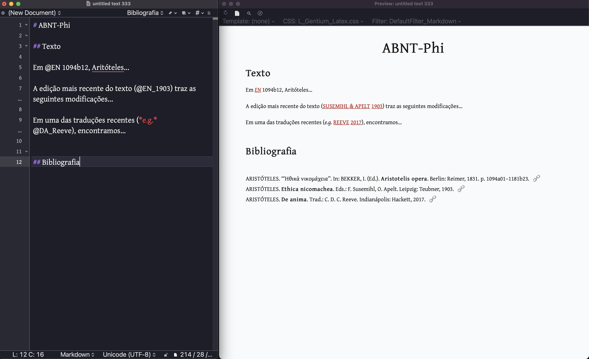

# ABNT-Phi

Esse é um estilo que adaptei para facilitar a citação de textos antigos utilizando o filtro CITEPROC do Pandoc. 
Essa versão é consideravelmente mais simples do que a primeira adaptação ([CSL ABNT para autores antigos](https://github.com/bcdavasconcelos/CSL-ABNT-para-Autores-Antigos)).  

Sem algum tipo de adaptação aos arquivos CSL no formato ABNT, seria impossível utilizar de modo satisfatório o processamento automatizado da bibliografia do [Pandoc](https://pandoc.org/MANUAL.html#citation-rendering). Uma citação da ed. Bekker, de uma outra edição crítica qualquer ou de uma tradução do texto, traria sempre o nome do autor para a citação em linha.   

Arquivos de bibliografia tradicionais raramente levam em conta a necessidade de incluir na citação em linha algum dado diferente do esquema tradicional (AUTOR ANO). Na área de estudos antigos e da Filosofia em geral, entretanto, frequentemente citamos obras clássicas a partir de um [sistema de abreviações](http://dge.cchs.csic.es/lst/lst1.htm) consagrado no meio acadêmico especializado. Além disso, em alguns casos pode ser mais relevante incluir o nome do editor ou do tradutor do texto, visto que o nome do autor já é conhecido e está pressuposto.   

A diferença entre esse estilo ABNT e os demais, é que ele dará preferência ao conteúdo de dois campos em particular da bibliografia:  `shorttitle` e `annote`.  

- O primeiro serve para abreviações e se o campo estiver preenchido, apenas a abreviação será impressa, em itálico e sem o ano.  
- O segundo serve para o(s) nome(s) que forem pertinentes e que devem aparecer na citação em linha ao invés do nome do autor. É importante observar que o conteúdo no campo `annote` será impresso exatamente como se encontra na bibliografia. Não haverá capitalização ou qualquer outra modificação.  

Na prática, você pode utilizar esse estilo para manipular toda a citação em linha de uma determinada obra. Você terá a opção de escolher o conteúdo a ser impresso e se o ano deve ser incluído ou não (se utilizar `shorttitle` o ano ficará de fora; se utilizar `annote` ele será impresso normalmente).  

Esse estilo pode ser utilizado com o Pandoc (v. 2.14 em diante) e com gerenciadores de bibliografia como Zotero e Mendeley.  

# Instruções para testar

- Faça o download e instale o [Pandoc](https://pandoc.org/MANUAL.html).  
- Baixe o conteúdo deste repositório, mude o nome para Pandoc e mova para a sua pasta do Dropbox (ou alguma outra de sua preferência).  
- Para acrescentar a bibliografia a uma conversão do Pandoc, basta adicionar alguns elementos ao comando, como a flag `-C`  seguida de `--csl=` e o endereço do arquivo CSL; `--bibliography=` e o arquivo da bibliografia.  

No meu caso, os arquivos estão na seguinte localização:  

`~/Dropbox/Pandoc/refs.bib`  
 `~/Dropbox/Pandoc/abnt-phi.csl`  

Portanto, devo acrescentar:

```bash
-C "--bibliography=$HOME/Dropbox/Pandoc/refs.bib" "--csl=$HOME/Dropbox/Pandoc/abnt-phi.csl" 
```

O comando completo, portanto, seria:

```bash
pandoc -f markdown "$HOME/Dropbox/Pandoc/test.md" -t docx -o "$HOME/Dropbox/Pandoc/test.docx" -C "--csl=$HOME/Dropbox/Pandoc/abnt-phi.csl" "--bibliography=$HOME/Dropbox/Pandoc/refs.bib"
```

Esse estilo também pode ser utilizado via Zotero ou Mendeley.

  
